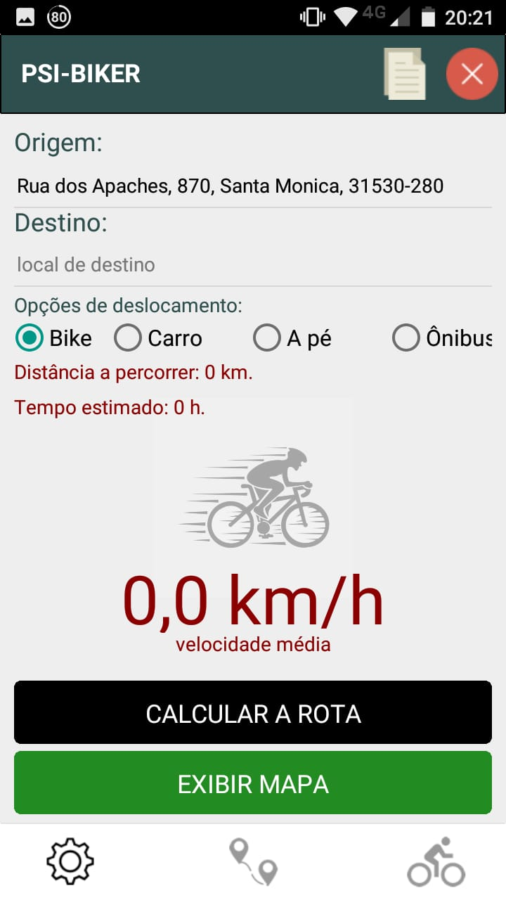
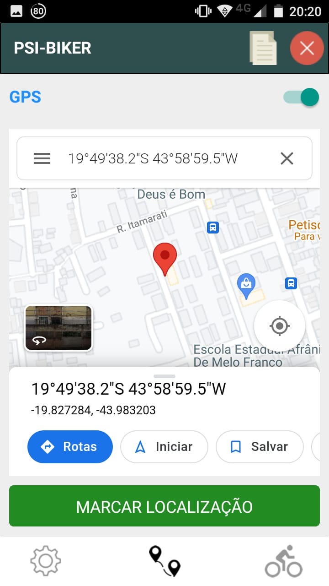
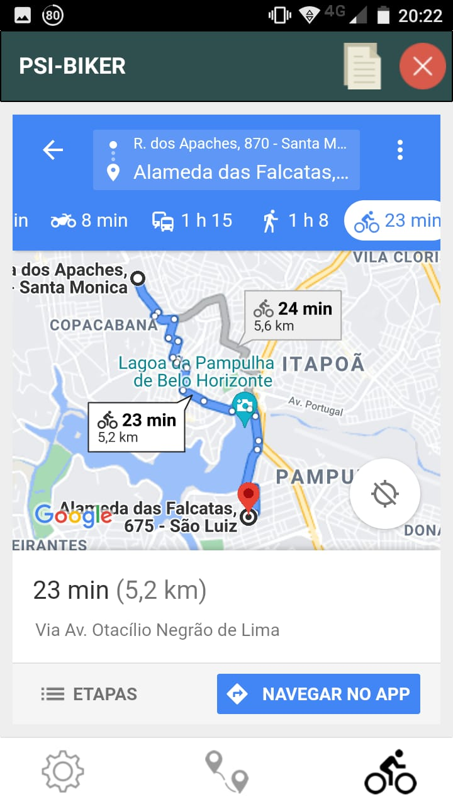

 
## psi-biker v1.1 (Delphi 10.3 Rio)
App Mobile p/ Bikers calcularem o Tempo e Distância de uma rota entre Origem e Destino (modelo de estudo) 
usando a API Distance Matrix do Gooogle Maps, desenvolvido em Delphi 10.3 Rio usando REST e JSON

   

## Doações
Como agradecimento, e apoio, se desejar fazer uma contribuição, poderá fazer via transferência ou depósito bancário, minha chave PIX (CNPJ) é 18.478.810/0001-13 PagSeguro-UOL (PagBank) p/ Ezequias Martins da Costa Barbosa. Desde já agradeço e conto com a sua colaração!

## Contato

telefone: (31) 98410-7540 WhatsApp

email: ezequiasmartins@gmail.com

by <a href="https://ezequiasmartins.blogspot.com/" target="_blank">Ezequias Martins</a> ® 1999-2022 Direitos Reservados

